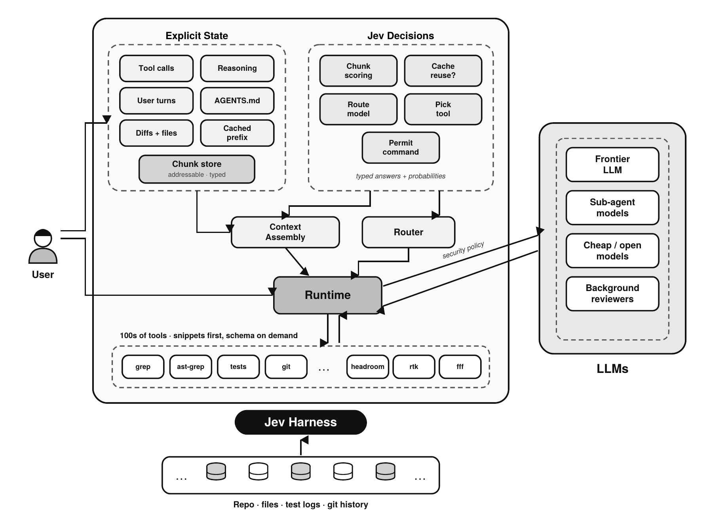
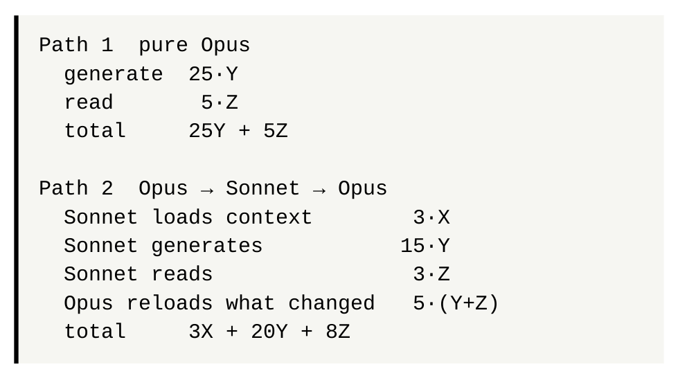
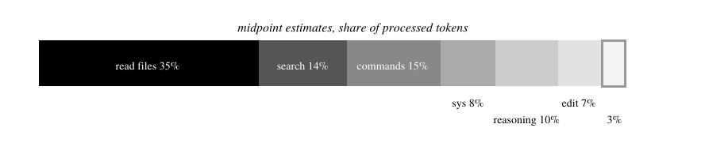
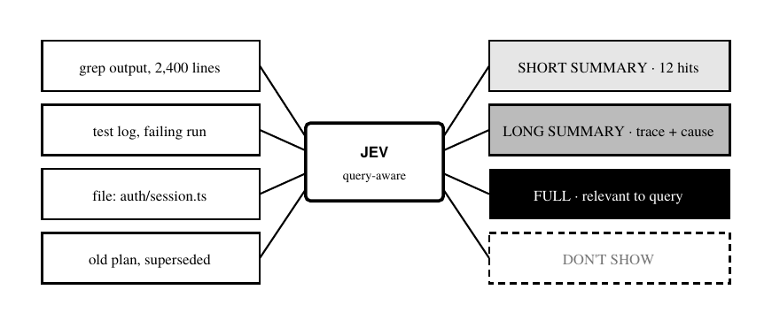
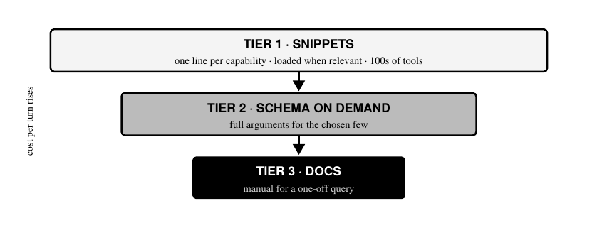
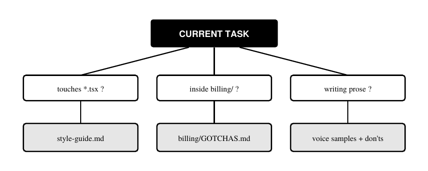
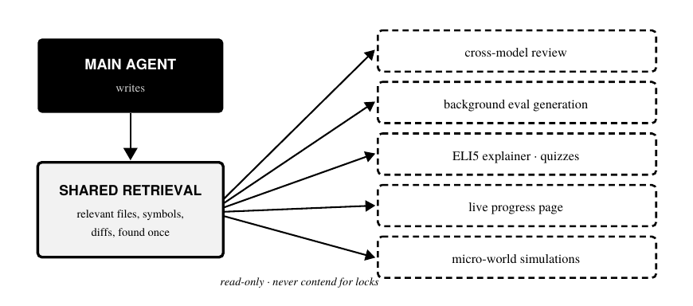

# Jev 工程学：为 coding agent 而作

> **2026 年 Jev 工程实践工作笔记**
> 副标题：TypeSafe 创始人的 Jev 构建蓝图
> A Synthesis for Study · Based on design notes by Diogo Almeida (TypeSafe)
> 独立汇编，2026 年 9 月。与 TypeSafe 无隶属关系，亦未获其背书。
>
> 本文是 [原文 PDF](assets/original.pdf) 的完整中文翻译，保留原有结构与全部七张插图。

> **本仓库现在有两份文档**
>
> - 本页（根目录）：第三方根据笔记**汇编整理**的工作笔记——结构正式、有图表、「六个症状」已表格化
> - [`source-notes/`](source-notes/)：作者的**原始设计笔记**——保留了原始项目符号结构、随手记的链接，以及尚未定型的口语化表达
>
> 两份对照读，能看到从笔记到成文的加工过程。原始笔记里有汇编版没有的内容（如 SLOP 子任务拆解、附录 2 引用的原始推文、以及作者的推理过程）。

---



*图 1. Jev harness。显式状态（左）以可寻址、带类型的块存储。Jev（右）回答每一轮的问题：显示哪些块、是否复用缓存、用哪个模型和工具、以及一条命令能否执行。上下文组装层与路由器驱动运行时，运行时以「片段优先」的方式披露数百个工具，并在安全策略下把工作路由到前沿模型、子 agent、廉价模型或后台模型。*

---

## 摘要

Coding agent 简单得出人意料。大多数就是一个模型加少量工具的 while 循环，而模型本身之外几乎没有什么有意义的创新。

这份笔记综合了 TypeSafe 创始人 Diogo Almeida 的设计笔记，讲的是围绕 Jev 构建 coding agent 的思路——Jev 是 TypeSafe 的决策模型，把结构化状态转换成类型化输出，例如 choice、score 和 noul 决策。

笔记从一个挑衅性的问题开始：**如果语言模型没有 KV cache，你会怎么设计一个 coding agent？**

这个问题暴露了当前 agent 不加审视就继承的六个设计选择：**亏损的路由、挤占上下文的工具调用、盲目压缩的 compaction、几乎不触发的子 agent、丢弃状态的重启、以及电池之争。**

我们呈现笔记提出的替代架构：一个围绕显式、带类型状态构建的 harness，由 Jev 做每一轮的决策。其中上下文块按查询逐个打分，路由定价时计入重新处理的成本，工具分级披露，指令按条件加载，只读的后台任务共享一次检索。

我们还演算一遍路由算术、真实 agent 会话的 token 经济学，以及按文件敏感度（而不仅是难度）路由的安全论证。

**索引词**：Jev、TypeSafe、coding agent、harness 工程、KV cache、上下文工程、模型路由、子 agent、工具调用、compaction、AGENTS.md、后台 agent。

---

## I. 为什么还要再做一个 agent

笔记以四个工作假设开场。

**第一，coding agent 很简单**，尤其是 agent 的部分：一个循环、一个模型、少量工具。

**第二，现有 agent 中最好的部分可以复用。** 前沿模型都能通过 API 拿到，开源项目提供了灵感和甚至 UI 组件，而只有少数领域（比如 MCP 服务器的认证）才带有真正的复杂性。

**第三，第一方 agent 的成本优势可能在缩小**，因为用量正从捆绑订阅转向按量付费的 API 定价。

**第四，也是最重要的，有些能力只能原生构建。** 它们无法作为插件交付给别人的 agent，因为它们要求控制**每一轮上下文是如何被组装的**。

第四个假设就是论点。**如果 agent 只是一个循环，那么杠杆不在循环里。杠杆在于循环每一轮喂给模型的东西。**

### A. Jev 站在哪里

**Jev 不是写代码的模型，它是旁边那层决策层。**

harness 把当前应用状态（目标、上下文、规则、可用动作、之前的动作）和一个预定义问题交给 Jev，Jev 返回一个类型化答案：choice、score 或 noul，每个都带概率。然后由前沿模型、子 agent、工具和确定性代码去做实际工作。

因为输出是类型化的而不是自由文本，harness 可以验证它、施加阈值、基于它分支，而不必解析散文。

这份笔记里每一个原生功能，底层都是在高频决策点上问 Jev 一个问题。**每个会话被问上千次，那些小决策才是杠杆所在。**

### B. 组织起一切的那个问题

笔记描述了一个他喜欢问其他工程师的问题：**如果语言模型没有 KV cache，你会怎么设计 coding agent？**

KV cache 是 agent 被建成「只追加对话记录」的原因。复用缓存前缀很便宜；改动上下文早期的东西会让缓存失效，迫使模型重新处理改动之后的一切。**这个单一的经济事实塑造了当前 agent 的几乎每一个设计决策——而且通常没人把这件事说出来。**

想象把缓存拿掉，会做两件事。它允许一种为 Jev 设计的、状态显式的架构——**上下文是被组装的，而不是被累积的**。同时它揭示为什么「把简单活路由给便宜模型」这种直觉上正确的想法在实践中会失败。

笔记管这叫 **「KV cache 的暴政」**。

---

## II. KV cache 的六个症状

| 症状 | 为什么存在 | 代价 |
|---|---|---|
| 1. 路由失效 | 交还给大模型时需要重新处理上下文 | 混合路由比纯前沿更贵 |
| 2. 工具挤占上下文 | schema 必须待在系统消息里 | token 花在无关工具上；选择质量下降 |
| 3. Compaction | 假设所有未来轮次共享同一份状态 | 查询无关的压缩丢掉了后面需要的东西 |
| 4. 子 agent 稀少 | 决定传什么上下文进去、什么合并回来很难 | 几乎没有自动并行 |
| 5. 重启 | 有状态的对话记录会随时间腐坏 | 相关的旧状态跟着坏状态一起被丢弃 |
| 6. 电池之争 | 每个内置能力都永久消耗上下文 | 在易用与强大之间被迫二选一 |

### A. 路由不工作

直觉方案是让前沿模型规划、把执行交给便宜模型、再让前沿模型回来审查。笔记用 Opus（$5 输入 / $25 输出每百万 token）和 Sonnet（$3 / $15）的标价算了这笔账。设 X 是上下文 token，Y 是生成的输出 token，Z 是工作中额外读入的 token（比如命令输出和文件读取）。

```
路径 1  纯 Opus
  生成        25·Y
  读取        5·Z
  合计        25Y + 5Z

路径 2  Opus → Sonnet → Opus
  Sonnet 载入上下文         3·X
  Sonnet 生成               15·Y
  Sonnet 读取               3·Z
  Opus 重新加载变化的部分    5·(Y+Z)
  合计                      3X + 20Y + 8Z
```

当会话很长（X 大）、或工作读取远多于写入、或两者兼有时，路径 2 更贵。**代入一个合理的会话形态 X = 0.65、Y = 0.12、Z = 0.23，纯 Opus 是 4.15，路由路径是 6.19。**

**留在前沿模型上的成本，大约是那条本该省钱的路径的三分之二。**



*图 2. 路由陷阱。把执行委派给便宜模型，会在下行时加一次上下文载入、在回程时加一次重新处理，两者加起来超过了每 token 的折扣。*

教训不是「路由是错的」，而是**按 token 定价、而不是按上下文重建定价的路由是错的**。路由只有在两个条件下才可行：**harness 能给便宜模型一个小而专用的上下文（而不是完整记录），且回程不强迫前沿模型重读助手产出的一切。**

### B. 工具调用是个奇怪的取舍

工具必须提前在系统消息里声明，带着完整的参数 schema，不管这轮用不用得上。这消耗大量上下文，而且笔记的判断是：**它并不产生特别聪明的工具选择。**

工作假设是：模型在「高基数」（一次给太多工具）和「离策略工具调用」（工具的使用模式与训练时见过的不符）的某种组合上挣扎。

**这可能就是为什么 skills——加载一句短描述、细节延后——常常胜过裸工具列表和 MCP 服务器。**

### C. Compaction 存在

如果每个未来轮次都想要同一份共享状态，compaction 就完全合理。笔记质疑的正是这个假设。

**Compaction 试图做通用压缩，这既难又有损。而查询感知的压缩容易得多：如果你知道下一个问题是什么，你就知道该留什么。**

**在问题已知之前写下的摘要，一定会丢掉问题需要的东西。**

### D. 子 agent 很平庸

模型并行的程度低于预期。怀疑的原因在状态管理：**决定父上下文的哪些部分要传进去、每个子 agent 的发现中哪些要合并回来。**

**当这个决策既昂贵又容易出错时，模型就会回避它。**

### E. 重启存在

重启会话是对话记录漂移或损坏时的标准补救。**但它把坏状态和好状态一起丢掉了。**

有了可寻址状态，替代方案是干净启动、按需只重新加载仍然相关的旧块。

### F. 电池并非内置

关于 agent 是否该内置能力，有一场持续的争论。今天它是在「易用」（重度内置的 agent 在一端）和「强大」（Claude Code、Codex 这类高级用户工具在另一端）之间的取舍。

**这个取舍存在，仅仅因为每块电池都永久消耗上下文。把那个成本拿掉，争论就消解了。**

---

## III. token 到底花在哪

在重新设计 harness 之前，先搞清楚一次会话里哪个部分吃掉了预算。下表估算典型 CLI coding agent 会话中，各子任务占总处理 token 的份额。**这是输入密集视角，所以重复读取每次计数。**

| 子任务 | 约占 | 说明 |
|---|---|---|
| 读文件内容 | 30–40% | 最大项；文件作为上下文被反复读取 |
| 搜索代码库 | 10–18% | grep、glob、列表；输出噪音大 |
| 命令输出 | 10–20% | 堆栈和日志在失败时爆开 |
| 系统提示、工具 schema、AGENTS.md | 5–12% | 每一轮都付的固定开销 |
| 对话重放放大器 | — | 为什么上面每一项都被重复计数 |
| 推理与规划 | 5–15% | 困难调试时更高 |
| 写和编辑代码 | 4–10% | diff 和 str_replace 编辑很紧凑 |
| 向用户解释 | 2–5% | CLI agent 默认简洁 |



*图 3. 检索占主导。读取、搜索和命令输出合计约占处理 token 的三分之二；写代码不到十分之一。*

**最触目惊心的是倒数第二行：写代码，也就是 coding agent 存在的理由，是其中最小的开支项之一。读取和搜索占主导。**

独立的分析指向同一方向：**微软的 fastcontext 项目报告，在 GPT-5.4 的轨迹里，读取和搜索占所有工具调用轮次的 56.2%、占主 agent 总 token 的 46.5%。**

**如果这能推广，coding agent 里最大的效率收益不是更好的模型或更好的 diff 格式，而是更聪明的检索。**

---

## IV. 基础层：权限与工具路由

有两项改进可以集成到任何现有 agent 里，无论原生与否。

### A. 可编程权限

每一条 agent 运行的命令都提出「它到底该不该跑」的问题。Claude 的 auto 模式用分类器回答这个。**笔记提议走得更远：权限表达为对「什么允许、什么不允许」的可编程查询，** 而且在风险足够高时做更深的检查——比如在执行前读取 Python 或 shell 文件的内容，而不是只批准命令名。

```yaml
policy "exec":
  deny   if command touches ~/.ssh or .env*
  deny   if script contents contain network egress
         and task.scope != "deploy"
  ask    if command writes outside repo root
  allow  if command in read_only_set
  allow  if tests/ and exit code is expected
```

### B. harness 作为工具路由器

不是把每个工具 schema 都暴露给模型，而是让 harness 坐在意图和调用之间。**模型用纯文本描述它想干什么。** harness 然后用一串类型化的 Jev 调用来选出最合适的那个工具（或前几名候选），并构造参数。

**模型永远不必在上下文里持有几百个 schema，而错误的参数类型会变成验证错误，而不是静默失败。**

---

## V. 元注意力：把上下文本身当成决策

核心提议去掉了「上下文是静态的」这个观念。

**对每一个用户查询，harness 问 Jev 两件事：**

**第一，之前的上下文有多好**——复用现有 KV cache 是对的吗，还是从头重建更便宜也更好？**这被框定为一个显式的、成本感知的决策，而不是默认行为。**

**第二，如何构造一个包含所有相关的、且不含任何多余的新上下文。**

最简单的形态是：对每一个上下文块做一次 noul——每次工具调用的输入、每次工具调用的输出、每一段内部推理、以及可能每一次与用户的交流。**后续版本把分数换成可见性级别。**



*图 4. 可见性阶梯。同一个块可以被隐藏、简短总结、详细总结或完整展示，取决于当前查询。**这就是查询感知的压缩——compaction 所缺的那个属性。***

收益是：**compaction 背后的想法活下来了，但它的主要缺陷消失了。Compaction 在知道问题之前压缩一次；阶梯在知道问题之后按查询压缩。**

**一个 2400 行的 grep 结果，对某个问题可以是十二条相关命中，对下一个问题可以是不可见的——而它从未从状态里被删除。**

笔记还加了一个值得注意的视觉想法：**如果 harness 能热力图显示 grep 输出里哪部分相关，它就能按预算允许的程度随意过滤那份输出。** 而且，笔记观察到，**它看起来也会很酷。**

---

## VI. 路由与子 agent 重访

**一等公民的动态上下文，是让路由重新可行的原因。**

一旦 harness 能为子任务构造一个小而相关的上下文，把这个子任务交给更便宜或更快的模型就不需要便宜模型载入整个会话，**而结果可以作为被评分的块合并回来，而不是一份前沿模型必须重读的记录。**

同一机制解锁了子 agent。**笔记的猜测是：今天子 agent 成本的大部分，是决定传什么上下文的工作**——相比之下，用户敲一条简单指令反而容易。

**如果构造那个上下文变得便宜且自动，子 agent 就能用得频繁得多。**

它还打开了一个面向用户的控制：**多花钱换更快或更好的结果，还是保守运行、尽量少花。**

### A. 极端并行

如果派发任务变得便宜，很多任务会同时跑，harness 就继承了并发系统的全部问题：**同步原语、agent 间通信、多个 agent 共享状态时的写冲突。**

笔记建议用带锁的共享状态。**而显式区分读与写让它变得可处理，因为只读任务永远不会争锁。**

### B. 目标去重

对 /goal 这类目标驱动的循环，一个悬而未决的问题是：agent 会不会重复劳动。

一个缓解措施：**在派发任何子任务之前，把它注册为子目标，并与所有历史子目标去重。已经做过的、或正在飞行中的工作，永远不会被启动两次。**

---

## VII. 工具与技能，从第一性原理出发

笔记主张在「今天总是加载的工具」和「按需加载的 skills」之间加一层。

**模型无法提出一个它不知道存在的动作**，所以它需要短片段来描述有什么可用，类似于 skill 描述。**但这些片段不必住在系统消息里——它们可以在相关时动态加载。**

它们背后是「在需要时倾倒出可用动作的完整 schema」的能力，类似一个工具搜索工具。

**把这一切绑在一起的要求是：这些东西在不再需要之后，都不能污染上下文。**



*图 5. 三级披露。模型看到一张廉价的全局地图，只为它选中的东西付细节的钱，用完之后把细节从上下文中丢掉。*

**如果这能成，第二节里的电池之争就消失了：当一个内置能力在被使用之前几乎不花成本，agent 就能带着几百个工具和几千页文档发布。**

笔记还点出第二个好处：**近乎零成本的集成是强有力的联合营销渠道，而且它们让事情「就是能用」。**

### A. 更好的电池

很多社区工具承诺帮助 agent，实际上并没有。笔记举了一个工具输出压缩器作为例子，并猜测原因：**模型并不原生理解这些工具。**

**一个原生 harness 可以发布第一方的提示词，教模型如何使用每一个工具**——实际上相当于每个工具配一个内置的子 agent 或 skill。而它干净的上下文意味着工具的自定义逻辑不会污染会话的其余部分。

这里也有营销角度：**为你当前流行的工具发布集成，能让 agent 保持在对话之中。**

---

## VIII. 条件化指令

**今天的 AGENTS.md 是全量加载的。笔记提议按条件加载。**

改前端代码就加载风格指南；在某个子目录里工作就加载那个目录的坑文件（**而且笔记建议每个子目录都该有一个**）。



*图 6. 条件化 AGENTS.md。指令附着到条件上而不是会话上，而且条件片段会被钉住，使 compaction 无法把它摘要掉。*

这像 skills，但笔记画出了一个区别：**skills 通常意味着「现在做这个」。条件化指令意味着「把这段记在某处」。**

**第二种还需要一个 skills 没有的属性：免疫于压缩。** 一个在长会话早期加载的 skill 最终会被压缩或摘要掉；**而一个绑定到条件的指令会在条件成立时被重新加载。**

笔记在普通聊天里观察到同样的需求：请求摘要应该拉入一个偏好的格式；请求用自己风格写作应该拉入样本和一份「不要什么」的清单；请求代码应该拉入风格指南和一条「不要加一百万条断言」的提示。

### A. 结构化 skills

取决于 harness 变得多可编程，skills 可以携带行为变更而不只是指令，类似 Claude Code 的 skill hooks 但更强大。

**笔记指出的当前 hook 系统的一个限制是：一旦加上，hook 就永久留在会话里。结构化 skills 会随触发它们的条件附着和脱离行为。**

### B. 递归语言模型

一个相关方向是递归语言模型（recursive language models）的方法，它把 agent 更多的状态当作显式变量而不是对话记录文本。

**一个状态保存在具名变量里的世界，可能比「状态就是上下文窗口里恰好剩下的那些东西」的世界干净得多。**

---

## IX. 安全感知的路由

今天的路由围绕难度和成本。**笔记加了第三个轴：信任。**

一些通过低价供应商提供的开放权重模型比前沿 API 便宜得多，而笔记提出的担忧是：**经过某些端点的数据可能不再私有。**

提议是给每个子任务一个「可能触碰哪些文件」的估计，把策略附着到文件类型上，并据此路由。

| 可能触碰的文件 | 策略 | 可用模型 |
|---|---|---|
| 公开文档、开源依赖 | 开放 | 任意，最便宜的优先 |
| 应用代码 | 标准 | 经过审查的供应商 |
| 密钥、env、基础设施配置 | 受限 | 只用第一方前沿模型 |
| 专有研究代码 | 自定义 | 排除指定供应商 |

最后一行反映了一个更广的观点：**难度和成本不是路由的唯一理由。**

一个团队可能因为自己在做模型研究而避开某家供应商的模型，或因为安全工作而避开某些供应商。**一旦路由是策略驱动的，这些偏好就变成配置而不是纪律。**

---

## X. 后台处理

笔记识别出几种流行 agent 工作流里的一个共同模式：

- 构建随工作进展而并行更新的 HTML 页面
- 「理解而非生成才是新瓶颈」的论点
- 在后台生成 eval
- 用几张图加极少的字解释系统的 ELI5 技能
- 让 agent 维护一个小型已部署的进度页面，带截图和笔记，**可以在长任务期间从手机查看**

还有一个相关的生产模式：**把线上流量镜像到候选模型，自动生成约一天的 eval，然后才决定是否切换。**

它们的共同点是：**在后台运行、作为正常工作流的扩展、而且都是当前代码库状态的只读函数。** 跨模型审查（让一家供应商的 agent 审查另一家的产出）属于同一模式。



*图 7. 显式状态上的后台处理。找出与某个改动相关什么的这项昂贵工作，只做一次，由每个只读后台任务共享。*

**这正是 Jev 论点兑现的地方。** 以 Jev 为中心的 harness 必须精确知道上下文里有什么、以及每个操作是读还是写。**找出与某个代码改动相关的信息，是件不平凡的工作。**

**如果这份检索在所有后台任务间共享、而不是每个任务重复一遍，运行它们就会便宜得多，也就能经济地跑更多。** 考虑到第三节的发现——检索占主导地位——**共享它就是最大的单项节省。**

把读写显式区分开，用笔记的话说，**最终应该给 agent 超能力。**

---

## XI. 电池候选清单

笔记最后列了几个可以被原生集成的开源项目，每个都附了「以 Jev 为中心的 harness 会怎么用它」的设计说明。

| 项目 | 角色 | 原生角度 |
|---|---|---|
| headroom | 上下文压缩器 | 用分类器检查压缩是否保住了需要的事实 |
| rtk | 工具输出压缩 | 第一方提示，让模型理解它 |
| ast-grep | 结构化搜索 | 加载一次手册，生成 N 个查询，按相关性过滤 |
| ast-outline | 结构化大纲 | 层级调用：选出要检查的子树 |
| fastcontext | 仓库探索子 agent | 路由到它，或用结构替代它的搜索 |
| fff | 路径与内容搜索 | 内存索引、频率排序，长会话里比 ripgrep 快 |

---

## XII. 结论

设计笔记提出的论点**说起来容易、做起来难**：

**coding agent 是简单的循环，而杠杆不在循环里。杠杆在于 harness 每一轮放在模型面前的是什么——而今天这个决定是由默认值做的，由一份围绕 KV cache 经济性塑造的、只追加的对话记录做的。**

把缓存拿掉当作思想实验，六个熟悉的行为就变了样：

- **路由失败**是因为上下文被重新处理，不是因为便宜模型弱
- **工具挤满窗口**是因为它们必须提前声明
- **Compaction 丢信息**是因为它在问题已知之前压缩
- **子 agent 稀少**是因为传状态很难
- **重启**把好状态和坏状态一起丢掉
- **电池之争**之所以存在，只是因为每个内置能力永久消耗上下文

所提议的 harness 用一个动作应对全部六项：**让状态显式且带类型，让 Jev 按查询决定上下文、路由、工具和权限。**

块在可见性阶梯上被打分。路由按上下文重建定价。工具分级披露。指令附着到条件上。后台任务共享一次检索。

**这些都不需要更好的模型。它需要把上下文窗口当作一件被有意组装的东西，而不是一件偶然累积的东西。**

---

## 来源说明

独立汇编，供研究之用。与 TypeSafe 无隶属关系，亦未获其背书。Jev 依据 TypeSafe 材料描述为一个返回带概率的类型化 choice、score 和 noul 决策的决策模型。

核心论点、路由算术、六个症状以及所提议的功能，来自 TypeSafe 创始人 Diogo Almeida 提供给汇编者的设计笔记。

读取与搜索的份额数字（GPT-5.4 轨迹中占工具调用轮次的 56.2%、占主 agent token 的 46.5%）如微软 fastcontext 项目所报告。

token 份额表是对 CLI coding agent 会话的示意性估计。递归语言模型：A. Zhang, 2025。工具引用：headroom、rtk、ast-grep、ast-outline、fastcontext、fff（GitHub）。模型标价取自笔记所用，可能已经变动。所有图表均为原文所绘。

---

## 关于本翻译

- 原文：[assets/original.pdf](assets/original.pdf)（12 页，WeasyPrint 生成）
- 原文纯文本：[assets/original-text.txt](assets/original-text.txt)
- 插图：从原 PDF 的矢量图表按 300 DPI 精确裁切，共 7 张，位于 `figures/`
- 翻译保留原章节编号与结构；英文原文的排版错误（如小标题的大小写异常 `sIX sYMPTOMs OF THE Kv CACHE`）在译文中已按正常书写呈现
- **上游原始笔记**：[source-notes/](source-notes/)（本文档所依据的设计笔记，及其中文翻译）
