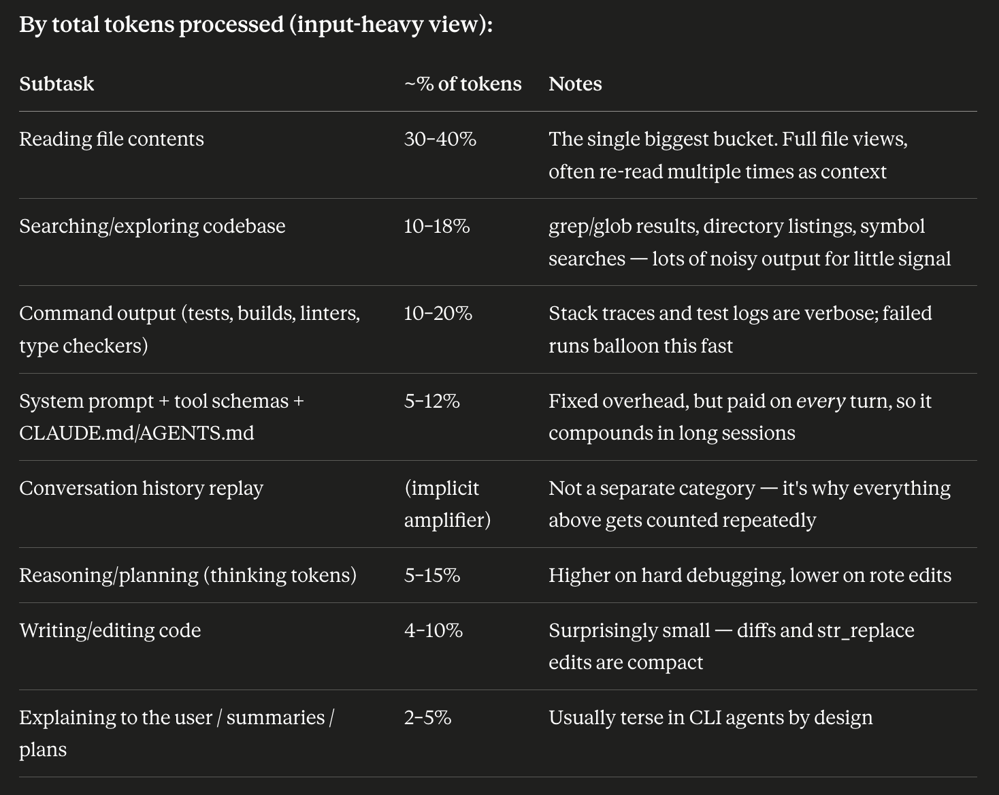
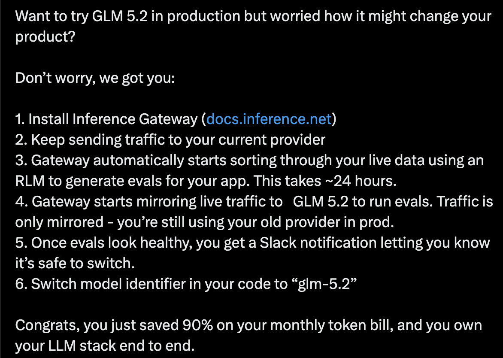
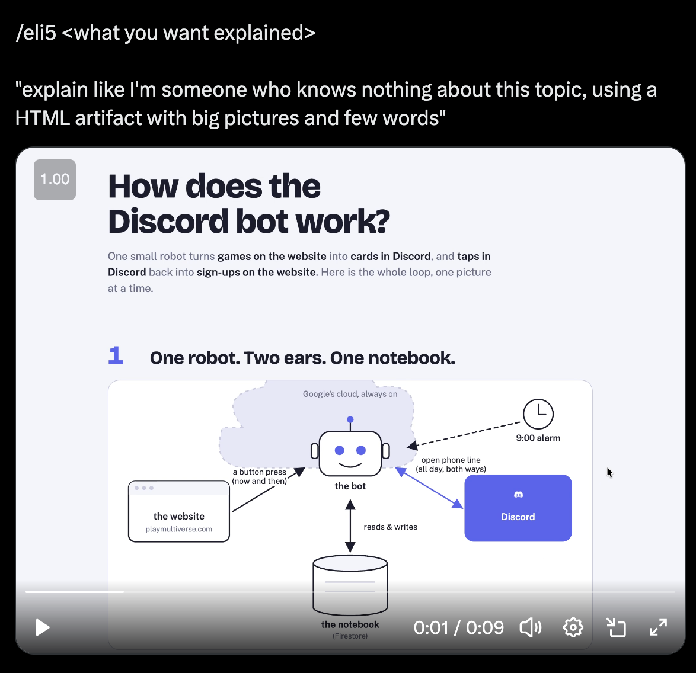
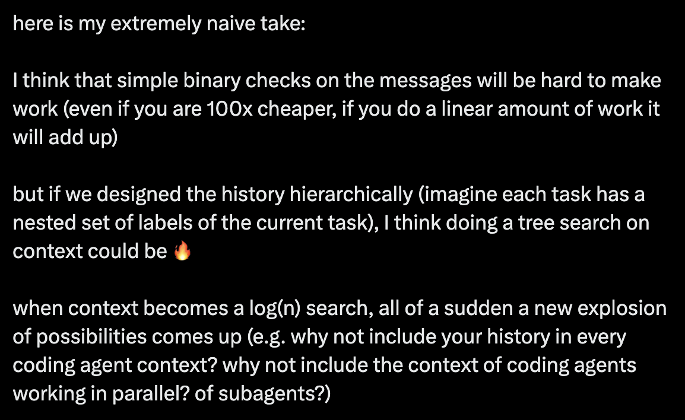

# [公开] 关于一个 typesafe coding agent 的思考

> **原始设计笔记**
> 作者：Diogo Almeida（TypeSafe 创始人）
> 来源：Google Docs（公开文档）· 导出 PDF 共 11 页
> 在线原文：https://docs.google.com/document/d/1G61uUB0FifUnmmrPzFQojZ3KpczYKmXGpgEXDJ2l_Zg/edit
>
> 本文是这些设计笔记的完整中文翻译。
>
> **与仓库根目录那份文档的关系**：根目录的《Jev 工程学：为 coding agent 而作》是第三方基于**这些笔记**汇编整理的工作笔记——结构更正式、补了图表和「六个症状」的表格化表述。这里是笔记本身，保留了原始的项目符号结构、随手记的链接、以及作者尚未定型的口语化表达。两份对照读，能看到从笔记到成文的加工过程。

---

## 为什么还要再做一个 agent？

- 我有几个关键假设：
  - **Coding agent 简单得出人意料**
    - 尤其是 agent 那部分
    - 它们往往就是一个 while 循环加少量工具
    - 非 agent 的部分似乎也鲜有有意义的创新
  - **我们可以复用现有 coding agent 中最好的部分**
    - 模型当然可以——我们应该能通过 API 用上所有最好的模型
    - 也许连 UX/UI 组件也能复用
      - 有大量开源项目可作灵感
    - （不确定认证这类复杂度如何，比如 MCP 的）
  - **第一方 agent 的成本优势可能在减弱**
    - （也许）看起来 agent 的使用正更多转向按量付费的 API 定价
- **有些事我们只能原生地做**
  - 也就是不做现有 agent 的插件
  - 我在这里最喜欢问别人一个问题：**「如果 LLM 没有 KV cache，你会怎么设计一个 coding agent？」**
    - 这显然允许我们设计一个以 typesafe 为中心的方案
    - 但同时也让我们看清当前设计的局限，以及为什么那些直觉上应该可行的做法其实不行

## KV cache 的暴政导致了哪些怪事？

### 怪事 1：路由不工作。旧的计算：

```
Path 1  pure Opus
  generate  25·Y
  read       5·Z
  total     25Y + 5Z

Path 2  Opus -> Sonnet -> Opus
  Sonnet loads context        3·X
  Sonnet generates           15·Y
  Sonnet reads                3·Z
  Opus reloads what changed   5·(Y+Z)
  total     3X + 20Y + 8Z
```

- X = 上下文 token，Y = 生成的输出 token，Z = 工作中读入的额外 token
- 量级大概是 X = 0.65、Y = 0.12、Z = 0.23
  - 于是纯 Opus ≈ 4.15，路由路径 ≈ 6.19

### 怪事 2：工具调用是个奇怪的取舍

- 工具必须提前声明，带着完整参数 schema
- 消耗大量上下文
- 而且不会产生特别聪明的工具选择
- 我猜原因是「高基数」和「离策略」的某种组合
- 这也许就是 skills 常常胜过裸工具列表 / MCP 服务器的原因

### 怪事 3：compaction 存在

- 这暗示了一个假设：**所有未来的轮次都想要同一份共享状态**
- 但通用压缩既难又有损。查询感知的压缩容易得多——如果你知道下一个问题是什么，你就知道该保留什么

### 怪事 4：子 agent 很平庸

- 模型并行的程度低于预期
- 我怀疑原因在状态管理：决定哪些父上下文要传进去、哪些发现要合并回来
- 当这件事昂贵且易错时，模型就会回避它

### 怪事 5：重启存在

- 重启是对话记录漂移 / 腐坏时的标准补救
- 但它把坏状态和好状态一起丢掉了
- 有了可寻址状态，替代方案是干净启动、按需只重新加载仍然相关的旧块

### 怪事 6：内置能力并非默认配置

- 关于 agent 是否该内置能力，有很大的争论
- 例子：https://x.com/sudoingx/status/2061073944611029393
- 往往存在一个取舍：易用性（openclaw 是极端）对专业用户需求（比如 Claude Code / Codex）

---

## TypeSafe + Coding Agent

我们可以做的事有一大堆，我按类别拆一下。

### 基础类——可以集成进任何 agent 的东西

**权限 / 批准**

- 这条命令该不该执行
  - 类似 Claude 的 auto 模式
  - 理想情况下用「什么允许 / 什么不允许」的可编程查询
- 可以有更深入的权限检查
  - 比如在执行文件之前读取它的内容（针对 python / bash 等）

**MCP / 工具调用**

- 我们可以做工具调用的路由器
- 先用一段高层次文字描述我们想做什么，然后用多次 typesafe 调用来确定最好的那一个工具，或前 X 个

### 进阶类——TypeSafe 原生能力

**「元注意力」：智能上下文 / 相关性 / 过滤**

- 「上下文是静态的」这个观念可以完全去掉
- 对任何一个用户查询，我们都可以重新计算：
  - **先前的上下文有多好**
    - 也即：复用现有 KV cache 很自然，但我们应该根据「复用当前 cache 的效果」与「从头重建」之间的比较，做有依据、成本感知的决策
  - **如何构造一个装进了所有相关内容的新上下文**
    - 最简单的形态：把每一个上下文「块」都当成一次 noul
      - 工具调用的输入
      - 工具调用的输出
      - 内部推理
      - 也许甚至包括与用户的往复交流
    - 未来版本甚至可以是对每个「块」的打分：
      - 不显示
      - 显示一小段摘要
      - 显示较长的摘要
      - 显示全部
      - （或类似的）

**路由 + 「子」agent**

- 一等公民的动态上下文会让把简单任务路由给更便宜 / 更快的模型变得更容易
  - 当然，一切都应该兼顾成本与模型能力
- 我的猜测是：子 agent 的一大成本在于「搞清楚上下文」，相比之下用户直接敲命令反而简单。如果这件事变得更容易 / 更便宜 / 更自动，我们就能用子 agent 做多得多的事
- 这很可能也会让我们向用户提供更多可调选项：多花钱换更好更快，还是保守地尽量少花

**从第一性原理出发的 Skills / MCP / 工具调用**

- 我认为中间应该增加一层：
  - **关于「有什么可用」的小片段**
    - 因为模型不可能提出一个它甚至不知道存在的动作
    - 类似 skills 的描述
      - 但它不必放在系统消息里，可以在合适时动态加载
  - **在需要时展开可用动作的完整 schema**
    - 类似 tool search tool
  - **而且这不污染上下文**
    - 前所未有 (:
- 如果这能成，我们就能真正内置各种各样的能力，而成本几乎为零
  - 如果能以近乎零成本内置能力，我们会获得强大的优势：既能联合营销，也能让事情「就是能用™」
  - （想象一下内建了几百个工具加几千页文档）

### 更怪的东西——先把想到的都记在这里

**更好的内置集成**

- 有一大堆人们鼓捣出来的项目，理想中应该帮助 agent，实际上并没有
  - 例子：https://github.com/rtk-ai/rtk
    - 上下文压缩工具
  - 我的猜测是：因为 LLM 并不原生理解它们
- 我们可以围绕这些工具做第一方的提示词等等，确保它们被正确地提示（把它想成针对某个工具的原生子 agent / skill）
- 我们上下文的干净程度让我们能够加载它们、而不被其自定义逻辑污染
- 一般来说，内置那些「当下最热」的项目，是给自己涨热度的好办法
  - 旁注：**一个开源的「热度载体」可能是个很棒的交付物**（某种能持续处于当下热点循环之中的东西）

**条件化系统消息 / AGENTS.md**

- 我们可以按不同条件动态加载 AGENTS.md 的不同部分
  - 比如：
    - 是前端吗？加载风格指南
    - 在这个子目录里吗？加载避坑说明（说实话，每个子目录都该有一份）
- 这有点像 skills，但我对 skills 的经验是它们倾向于「现在就做这个」，而不是「把这段记在某处」
  - 另外，「把这段记在某处」这个约束应该免疫于 compaction / 被过滤掉（也就是说，如果你加载了一个 skill，然后触发了 compaction，那个 skill 很可能被压缩掉 / 摘要掉）
- 旁注：我注意到我在聊天机器人上也真的很想要这个
  - 我要一份摘要？这是我想要的 org-mode 格式
  - 我要求用我的风格写作？这是样本加「不要做什么」
  - 是代码吗？别加一百万条断言，这是风格指南

**结构化 skills**

- 这个有点欠火候，但取决于我们把 harness 做得有多可编程，skills 可以带上一大堆行为变更
- 类似 claude skill hooks：https://code.claude.com/docs/en/hooks#hooks-in-skills-and-agents 但更强大
  - 我上次看的时候，这些会把 hook 永久加进会话

**递归语言模型**

- 见 https://alexzhang13.github.io/blog/2025/rlm/
- 大意是更多变量 / 显式状态
- **若把状态当作显式变量管理，系统会清晰得多**

**更花哨的摘要**

- 一个想法是：如果我们能把「这段 grep 输出里哪部分相关」做成热力图，就能按需动态裁减它
- **它会看起来很酷**

**极端子 agent + 并行化**

- 不确定这对我们会如何运作，但（因为上面那节）同时派发很多任务可能变得非常容易，然后我们就得解决那些烦人但有用的东西，比如同步原语、甚至 agent 间通信
  - 也就是说，它们可以共享状态，并有锁之类的机制来处理写冲突

**安全感知的路由**

- 中国的模型便宜得多，而且很可能把流经它们的数据全都捞走（比如 DeepSeek V4 便宜得离谱）
- 如果：
  - 子 agent / 任务对「可能触碰哪些类型的文件」有个概率概念
  - 我们对不同类型的文件有不同策略
- 那我们就能把其中一些查询路由给便宜得多的模型
- 进一步延伸：除了难度 / 成本，可能还有很多其他理由去路由（比如：不要用 Anthropic 的模型做 LLM 研究，不要用 OpenAI / Anthropic 做安全敏感任务）

---

## 附录

### 可以被集成 / 改进的示例工具

**headroom** — https://github.com/chopratejas/headroom

- 上下文压缩器
- 笔记：
  - 可以加一个分类器，判断这次压缩是否包含了必要 / 重要的信息

**rtk** — https://github.com/rtk-ai/rtk

- 工具输出压缩器

**ast-grep** — https://github.com/ast-grep/ast-grep

- 另一种搜索方式
- 笔记：
  - 对于新工具，我们可以为一次性查询加载手册，生成 N 个查询，然后用我们的模型按相关性过滤这些查询

**ast-outline** — https://ast-outline.github.io/

- 另一种结构化搜索
- 笔记：
  - 我在想能不能把它用于层级式函数调用——用模型判断该调查哪棵子树

**fastcontext**（微软）— https://github.com/microsoft/fastcontext

- 用于仓库探索的子 agent
- 笔记：
  - 有意思的说法：**在我们对 GPT-5.4 轨迹的分析中，读取和搜索占所有工具调用轮次的 56.2%、占主 agent 总 token 的 46.5%**
    - 如果这能推广，那可能意味着只要专注在这上面就能拿到大量效率
  - 两件事可能都有价值：
    - 能够智能地路由到子 agent
    - **用结构替代子 agent 的搜索！**

**fff** — https://github.com/dmtrKovalenko/fff

- 抗拼写错误的路径与内容搜索、按频率排序的文件访问、后台监视器，以及一个轻量的内存内容索引。在任何会搜索不止一次的长期运行进程里，都比 ripgrep、fzf 这类 CLI 快得多。

### 其他想法

- 我在想有没有办法让 /goal 这类行为更好（比如通过显式去重）
  - 我不确定它到底会不会重复，但你可以想象：在派发某件事之前，让它有一个「子目标」，并与所有先前的子目标去重
- **SLOP：coding agent 子任务的拆解**



  - 如果我们想为子任务做特殊行为，这份清单看起来是个不错的起点

### 附录 2：后台处理——一个潜在的 agent 模式

- 我注意到最近一些比较流行的 agent 工作流里出现了一个模式：
  - https://x.com/xpasky/status/2073298979203211628
    - 构建并行更新的 HTML 页面


  - https://x.com/geoffreylitt/status/2072522251300409556
    - 「理解才是新的瓶颈」


  - https://x.com/samhogan/status/2071608749429829858
    - 在后台生成 eval



  - https://x.com/trq212/status/2090884854590382515
    - ELI5 技能



- **这些东西有什么共同点？**
  - 最跳出来的一点是：**它们都在后台运行！**
  - 它们通常是对正常工作流的后台扩展
  - 而且它们不只是后台运行，**它们往往是当前代码库状态的只读函数**

- 说到这里，可能已经有一些现成的模式符合「后台处理」这个模子
  - 最跳出来的一个是**跨模型审查**
    - 比如：让 codex 审查 claude 的产出

---

## TypeSafe 在这里的位置？

- 我对一个以 TypeSafe 为中心的 coding agent 的假设之一是：**我们必须显式管理状态（上下文里的一切）**
  - 具体来说，更好地管理状态，能让我们在路由、子 agent 等方面高效得多
- 这一点与只读后台任务之间的协同效应很强！
  - 找出与某个代码改动相关的信息，想必是件不平凡的工作
  - **如果这份工作能在所有后台任务间共享**，运行它们就会便宜得多，成本也可能低到能经济地运行更多任务

🙃

- 我认为显式区分状态（读与写）最终应该会显著增强 agent 的能力

---

## 附录 3：近期发帖

https://x.com/CompleteSkeptic/status/2100804802339082717



---

## 关于本翻译

- 原文 PDF：[original.pdf](original.pdf)（11 页，Google Docs 导出）
- 原文纯文本（Google Docs 导出，比 PDF 提取更干净）：[original.txt](original.txt)
- 内嵌截图 6 张位于 `images/`
- 保留了原始的项目符号层级与口语化表达；作者的 `->`、`:`、`(:`、`™`、`🙃` 等非正式记号按原样呈现
- 原文中出现的外部链接（X 帖子、GitHub 仓库）原样保留
